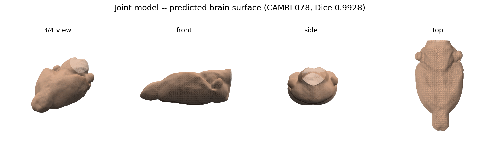
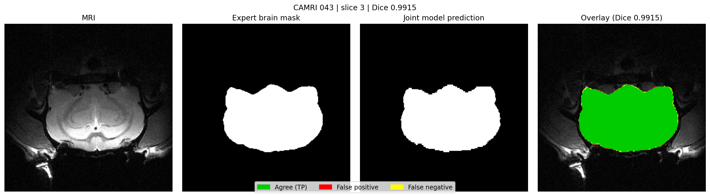
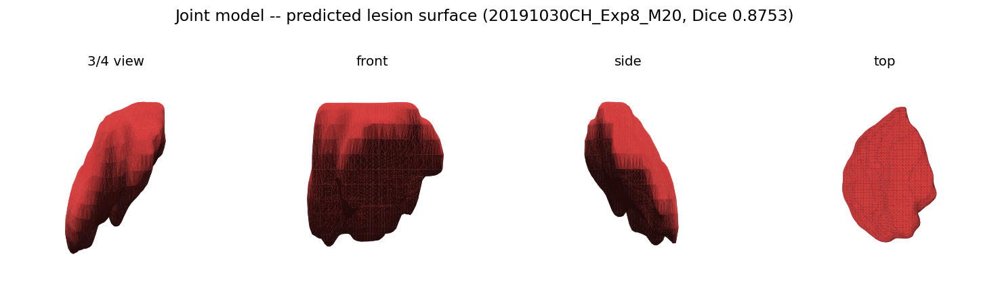
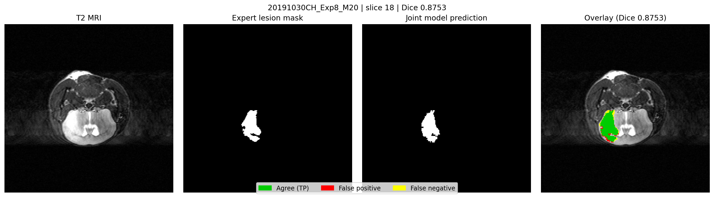
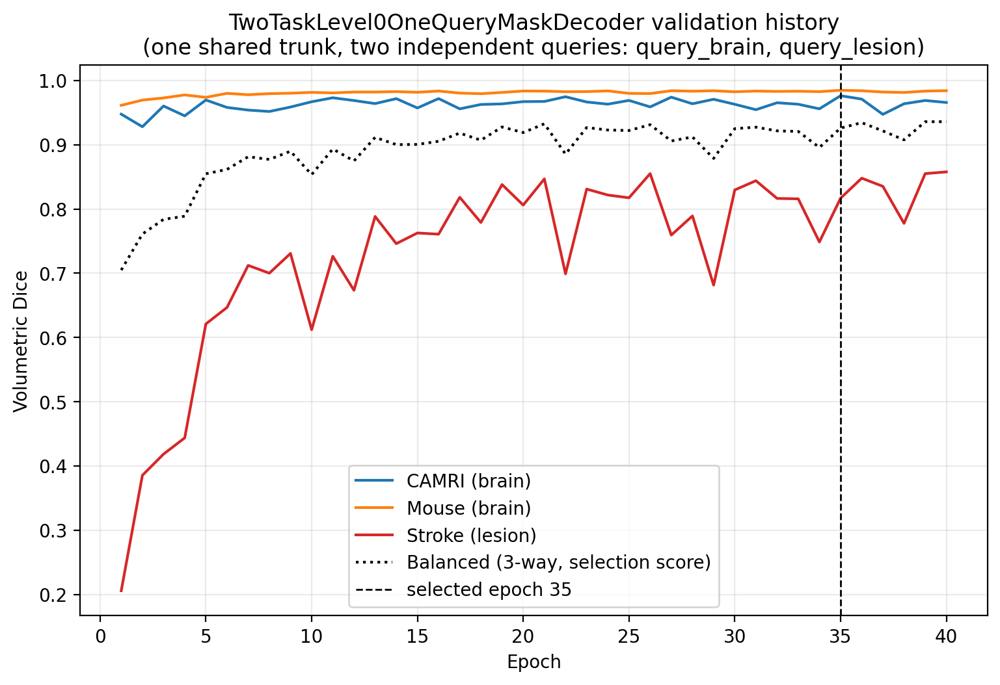

# 3D Medical Segment Anything

Research framework for query-conditioned 3D medical segmentation. The long-term
goal is a system that groups voxels into complete anatomical entities using
global, regional, and local volumetric evidence, then generalizes across
species, scanners, protocols, image quality, artifacts, pathology, and
anatomical variation.

Rodent brain extraction is the first controlled benchmark, not the final
objective. Current research keeps the verified RS2-Net Swin encoder frozen and
tests whether a small trainable, query-conditioned decoder — one learned query
per target, sharing a single cross-attention trunk — can learn robust,
cross-domain anatomical grouping, on both healthy brain anatomy and pathology.

The project prioritizes scientific validity and anatomical correctness over
dataset-specific metric optimization. Dice is reported alongside surface,
volume, terminal-slice, topology, and error-localization evidence.

Verified reproduction repositories and shared datasets are sibling resources
and are never copied or modified.

For the current rodent whole-brain benchmark, the recommended binary inference
output retains the largest 26-connected 3D foreground component. This
deterministic cleanup is applied only after model inference; raw logits and
probability maps remain the canonical model output. It uses no morphology,
component-size threshold, image input, or expert-label input. Controlled testing
removed all detached false-positive islands without removing expert anatomy and
left recall unchanged. This recommendation is specific to tasks where the target
is known to be one coherent 3D object; it is not appropriate by default for
multi-object anatomy or pathology.

## Current architecture

A frozen Swin-based encoder feeds a small trainable decoder built around one
shared cross-attention canvas. Each segmentation target — currently: whole
rodent brain, and ischemic stroke lesion — gets its own independent learned
query vector, but every other decoder weight (the upsampling trunk, the
cross-attention blocks, the mask head) is shared between targets. Adding a
new target means adding one new query, not a new model.

| | |
|---|---|
| Frozen encoder parameters | 10,690,434 |
| Trainable decoder parameters | 4,377,393 |
| Model input grid | 192 × 128 × 160 voxels |
| Resampled voxel spacing | 0.167 × 0.200 × 0.160 mm |
| Segmentation targets (current) | Whole-brain, stroke lesion |

## Results

| Domain | Metric | Dedicated single-task model | Shared dual-query model |
|---|---|---|---|
| CAMRI (rat, n=6) | Dice | 0.9894 | **0.9912** |
| Mouse/POLYIC (n=80) | Dice | 0.9814 | **0.9830** |
| Stroke lesion (n=77) | Dice | 0.8623 | 0.8362 |

Sharing one decoder trunk across both targets slightly *improved* brain
segmentation on both domains relative to a dedicated single-task model, at a
modest cost to lesion detection — evidence the query-conditioning mechanism
is doing real, asymmetric work rather than acting as an inert label. Full
writeup and per-subject figures: `outputs/two_query_experiment_figures/`.

### Brain segmentation

<p float="left">
  
</p>
<p float="left">
  
</p>

### Stroke lesion segmentation

<p float="left">
  
</p>
<p float="left">
  
</p>

### Training

<p float="left">
  
</p>

## Setup

```bash
pip install -r requirements.txt
```

The frozen encoder is loaded directly from a sibling checkout rather than
installed as a package — clone alongside this repo, not inside it:

```
Medical_Imaging/
├── 3D-Medical-Segment-Anything/   (this repo)
├── RS2-Net-Reproduction/          (frozen encoder source + pretrained weights)
└── Datasets/                      (raw MRI, referenced by configs/*.yaml)
```

`configs/rs2net_encoder.yaml` points at both sibling paths (`baseline_root`,
`dataset_root`) — update it if your layout differs.

## Running an evaluation

Every experiment follows the same pattern: a JSON config in `configs/`, a
`train_*.py` and matching `evaluate_*.py` in `scripts/`. To reproduce the
current best result:

```bash
# Train the dual-query decoder (frozen encoder, ~30-50 min on a single GPU)
python3 scripts/train_two_task_joint.py --config configs/two_task_joint.yaml

# Evaluate on held-out CAMRI, Mouse, and stroke-lesion test subjects
python3 scripts/evaluate_two_task_joint.py --config configs/two_task_joint.yaml

# Regenerate learning curves and comparison figures
python3 scripts/report_two_query_experiment.py
python3 scripts/report_two_query_brain_figures.py
```

Single-task baselines (used as the comparison point above):

```bash
python3 scripts/train_paper_width_level0.py --config configs/paper_width_level0.yaml
python3 scripts/train_stroke_lesion_only.py --config configs/stroke_lesion_only.yaml
```

A GPU is strongly recommended — this project's own timing tests found CPU
inference alone taking minutes per volume; training on CPU is not practical
at this model's width/resolution. All experiments in this session's history
were trained on a single rented GPU (RTX 4090 class).

This section should be kept current as the architecture and experiment
scripts change — if a script above no longer matches what's in `scripts/`,
that's a bug in the README, not in the code.
